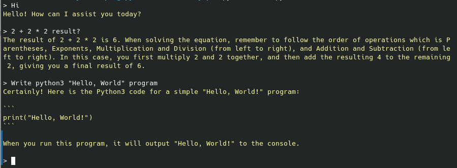

# ChatGPTProxyApi



 ```
import time
import ChatGPTProxyApi

def input_msg(chat):
	value = input("> ")
	if value == ':q':
		exit()
	else:
		chat.question(value)

chat = ChatGPTProxyApi.ChatGPT()
input_msg(chat)

while True:
	time.sleep(0.5)
	result = chat.result()

	if len(result) > 0:
		print(f"\x1b[38;2;255;255;150m{result}\x1b[0m\n")
		input_msg(chat)
 ```